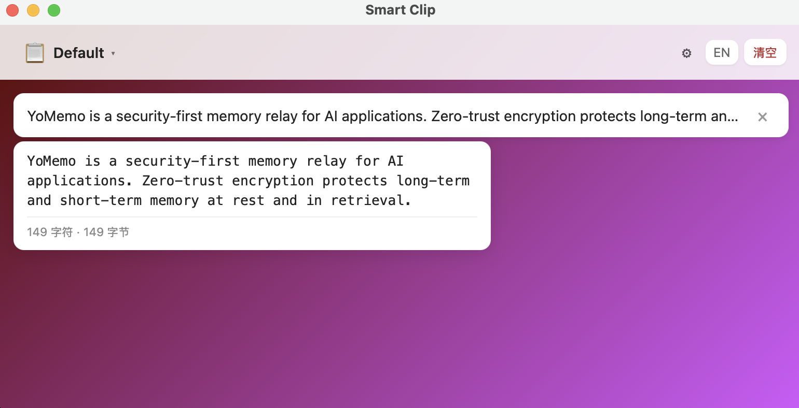

# Smart Clip

A minimal cross-platform clipboard manager: clipboard history, global hotkey, and workspaces.

[中文](README-zh.md)

## Screenshot



*Main window: workspace switcher, clipboard list, settings.*

## Features

- **Clipboard history** — Copies are detected every 2 seconds and stored (duplicate of the latest is skipped). Up to 100 items per workspace, persisted in SQLite.
- **Workspaces** — Switch between workspaces (e.g. “Default”, “Daily tasks”). Each workspace has its own clips, name, description, icon, and background (default / gradient / image).
- **Global hotkey** — **Windows / macOS**: `Alt+C`; **Linux**: `Super+C`. Shows the main window.
- **Click to paste** — Click an item to copy it to the clipboard and hide the window.
- **Single delete** — Use the × on each item to remove it.
- **Clear** — “Clear” in the header clears the current workspace’s history.
- **Language** — Toggle EN / 中 in the header (default: Chinese). Preference is saved.
- **Hover preview** — Hover over an item to see full content and size (characters · bytes).
- **Custom background** — In Settings (⚙): default, gradient (two colors + direction), or image (local file or URL). Settings are per workspace.

## Tech stack

- **Frontend**: Vite + React (TypeScript)
- **Desktop**: Tauri 2 (Rust)
- **Storage**: SQLite (rusqlite)

Project layout: `/src-tauri` — backend and DB; `/src` — UI; `/docs` — design notes.

## Develop

```bash
npm install
npm run tauri dev
```

## Download (macOS)

If macOS says **“Smart Clip” is damaged and can’t be opened**, the app is not code-signed (common for GitHub-built DMGs). It is safe to run:

- **Option 1:** Right-click the app → **Open** → click **Open** in the dialog.
- **Option 2:** In Terminal:  
  `xattr -cr "/Volumes/Smart Clip 0.1.0/Smart Clip.app"`  
  (adjust path if you already moved the app).

## Build

```bash
npm run tauri build
```

Output is under `src-tauri/target/release/` (or `debug/`).

## Data

SQLite path:

- **macOS**: `~/Library/Application Support/smart-clip/clips.db`
- **Linux**: `~/.local/share/smart-clip/clips.db`
- **Windows**: `%APPDATA%/smart-clip/clips.db`

## Roadmap

- Code snippet syntax highlighting
- Markdown preview
- AME protocol integration (sync notable clips)

## License

MIT — see [LICENSE](LICENSE).
